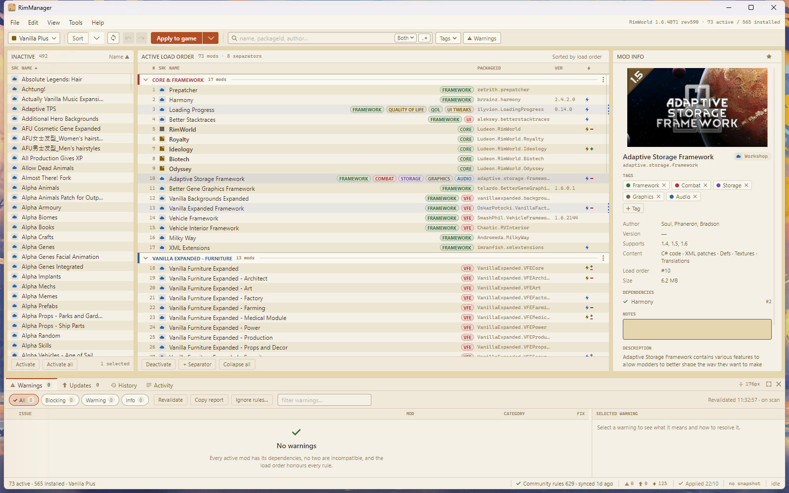
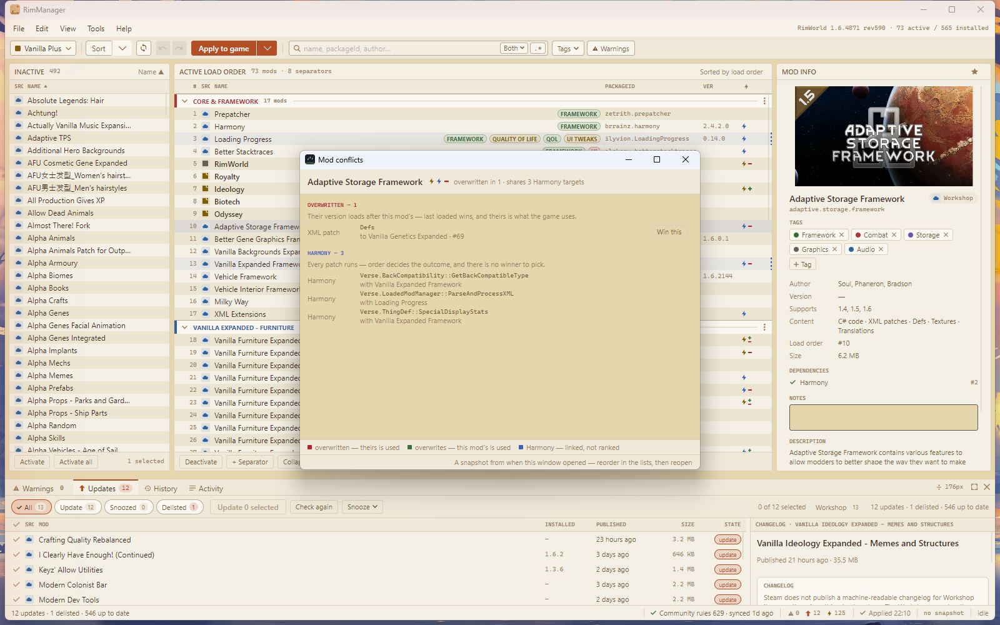
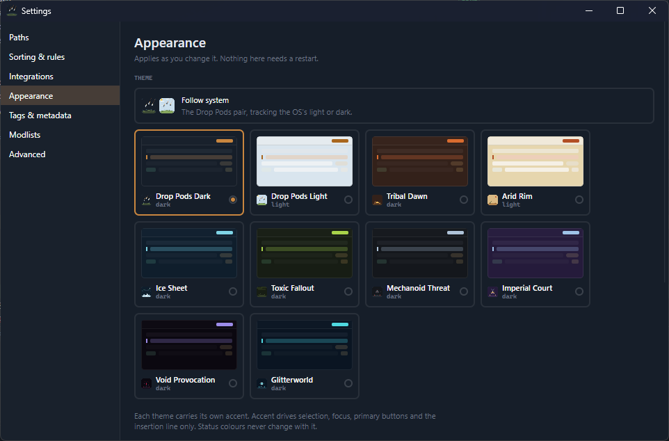
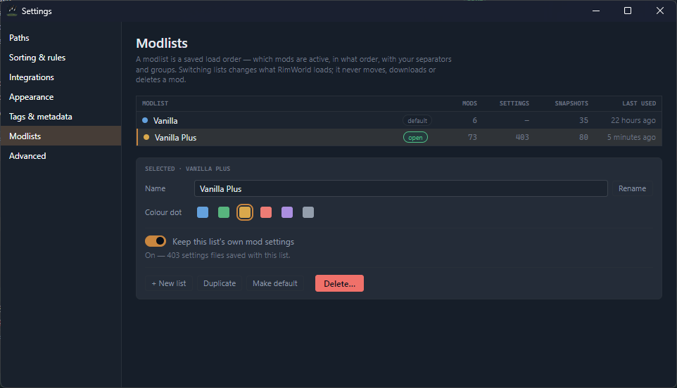

<div align="center">


# RimManager

A desktop mod manager for **RimWorld**, heavily inspired by [RimSort](https://github.com/RimSort/RimSort).<br>
Deterministic load-order sorting, assembly-level conflict detection and shareable modlists.<br>
Windows, macOS and Linux.

**[Releases](https://github.com/SalehBusbait/RimManager/releases) | [Issues](https://github.com/SalehBusbait/RimManager/issues) | [Support](#support)**

<a href="https://github.com/SalehBusbait/RimManager/releases"></a>
<a href="LICENSE"></a>


</div>

<picture>
  <source media="(prefers-color-scheme: dark)" srcset="assets/screenshots/main-window-dark.png">
  
</picture>

> [!NOTE]
> This is a pre-release. Version `1.0.0-beta.1` is in daily use against a 565-mod
> installation and the pipeline carries 1,469 tests, but it has had one reviewer.
> Defect reports are welcome.

## Features

- **One click, a working load order.** Hundreds of mods sorted into an order that works, the same way every time. When two mods genuinely disagree, RimManager tells you instead of quietly picking a side.

- **Catch conflicts before your colony does.** It looks inside each mod and finds the ones changing the same part of the game — the kind of clash that crashes a save three hours in — and shows you exactly which mod wins.

- **Know what's missing before you press Play.** Forgotten dependencies, disabled DLC, mods that refuse to work together, wrong game version — all listed up front, with fixes offered where a fix exists.

- **Never lose a load order that worked.** Every sort and every apply is saved as a snapshot you can name and return to. If an update breaks your game, go back to yesterday's list.

- **One modlist per playthrough.** Keep a list for each colony — each with its own mod settings — and switch between them. If RimWorld or another tool changes your order behind RimManager's back, you'll know.

- **Big lists, kept manageable.** Group mods under collapsible coloured separators, tag them, and filter down to what you're looking for.

- **Updates on your terms.** See exactly which Workshop mods have updates — and how old your versions are — before anything downloads. Steam does the downloading; your subscriptions are never touched.

- **Share your list in one file.** Send a friend a single small file, or a Steam collection, and they get your whole load order.

## Installation

Download the archive for the target platform from the
[releases page](https://github.com/SalehBusbait/RimManager/releases) and extract it. The
.NET runtime is included, so no separate installation or launcher is required.

| Platform | Archive | Notes |
|---|---|---|
| Windows | `win-x64` (`.zip`) | Run `RimManager.exe`. SmartScreen will report an unsigned application; choose **More info**, then **Run anyway**. |
| macOS | `osx-arm64` or `osx-x64` (`.tar.gz`) | Run `./RimManager`. Gatekeeper blocks unsigned binaries on first launch — permit it under **System Settings ▸ Privacy & Security**, or run `xattr -dr com.apple.quarantine RimManager`. |
| Linux | `linux-x64` (`.tar.gz`) | Run `./RimManager`. |

Archives named `RimManager-cli-*` contain the command-line binary, which exposes the same
capabilities for scripted use.

On first launch the RimWorld installation is located through Steam's library manifest. GOG
and manual installations can be selected in Settings.

## Screenshots

Per-mod conflict attribution: the Defs and Harmony methods a mod contends for, and which mod prevails.

<picture>
  <source media="(prefers-color-scheme: dark)" srcset="assets/screenshots/conflicts-dark.png">
  
</picture>

Ten themes, with light and dark treated as equals; each carries its own accent colour.



Modlists are the unit of switching, and each may retain its own mod settings.



<details>
<summary>Building from source</summary>

Requires the [.NET 10 SDK](https://dotnet.microsoft.com/download), pinned in `global.json`.

```
dotnet build RimManager.slnx -c Release
dotnet test  RimManager.slnx -c Release
dotnet run --project src/RimManager.App
```

The solution file is `RimManager.slnx`, the XML solution format. Warnings are treated as
errors in Release configuration. Tests requiring network access skip cleanly when offline.

</details>

## Acknowledgements

RimManager was heavily inspired by [RimSort](https://github.com/RimSort/RimSort), the mod
manager maintained by the RimWorld community. Readers seeking a mature tool with an
established user base should use it.

Sorting draws on the [Community Rules Database](https://github.com/RimSort/Community-Rules-Database),
curated and published by the RimSort project. Mod replacement and version-compatibility
data are provided by Mlie's [UseThisInstead](https://github.com/emipa606/UseThisInstead)
and [NoVersionWarning](https://github.com/emipa606/NoVersionWarning). All three are
retrieved at runtime; RimManager neither modifies nor redistributes them.

RimManager is an independent project. It is not affiliated with, endorsed by, or connected
to Ludeon Studios. RimWorld is a trademark of Ludeon Studios.

## Licence

RimManager is distributed under the [MIT Licence](LICENSE), copyright © 2026 Saleh Busubait.
Bundled third-party components retain their own licences; see
[THIRD-PARTY-NOTICES.md](THIRD-PARTY-NOTICES.md).

## Support

RimManager is free software and will remain so. No feature is reserved for donors, and no
capability is withheld behind a subscription.

Contributions toward continued development are welcome but entirely optional.

<div align="center">

<a href="https://ko-fi.com/salehbusubait"></a>

</div>
